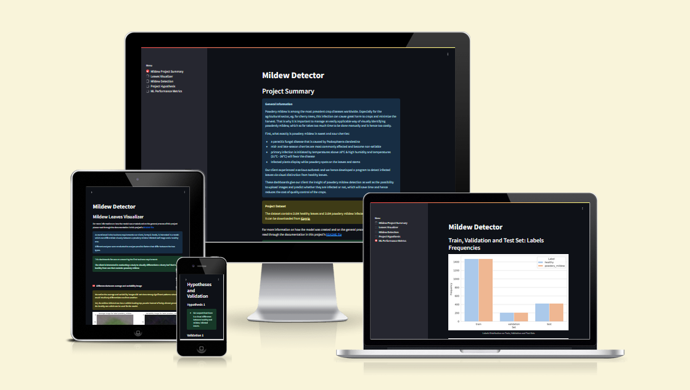

# Mildew Detection in Cherry Tree Leaves

[Mildew Detector - Deployed Website](https://pp5-mildew-detection.onrender.com/)

This "Mildew Detector" project used machine learning to predict whether cherry leaves on uploaded images are mildew-infected or not.
Powdery mildew is among the most prevalent crop diseases worldwide. Especially for the agricultural sector, eg. for cherry trees, this infection can cause great harm to crops and minimize the harvest. 
While farmers face an increasing number of hurdles during their work, especially with accelerating climate factors, there are some topics where machine learning models can take pressure from other time consuming daily tasks.
That is why it is important to manage an easily applicable way of visually identifying powdery mildew, which so far takes too much time to be done manually and is hence too costly.

Our dashboards serve our client, Farmy & Foods (a fictitious company), in giving a short overview of the models performance, as well as the ability to upload images and download a report with the prediction on which their employees can then decide which trees need treatment and which do not. Maximizing time efficiency and reducing costs.

## Contents
- [Mildew Detection in Cherry Tree Leaves](#mildew-detection-in-cherry-tree-leaves)
  - [Contents](#contents)
  - [Dataset Content](#dataset-content)
  - [Business Requirements](#business-requirements)
  - [Project Hypotheses and Validation](#project-hypotheses-and-validation)
    - [Hypothesis \& Validation 1](#hypothesis--validation-1)
    - [Hypothesis \& Validation 2](#hypothesis--validation-2)
    - [Hypothesis \& Validation 3](#hypothesis--validation-3)
  - [The rationale to map the business requirements to the Data Visualisations and ML tasks](#the-rationale-to-map-the-business-requirements-to-the-data-visualisations-and-ml-tasks)
  - [User Experience](#user-experience)
  - [ML Business Case](#ml-business-case)
  - [Dashboard Design](#dashboard-design)
    - [Summary Page](#summary-page)
    - [Leaves Visualizer Page](#leaves-visualizer-page)
    - [Mildew Detection Page](#mildew-detection-page)
    - [Project Hypothesis Page](#project-hypothesis-page)
    - [ML Performance Metrics Page](#ml-performance-metrics-page)
  - [Bugs](#bugs)
    - [Fixed Bugs](#fixed-bugs)
    - [Unfixed Bugs](#unfixed-bugs)
  - [Deployment](#deployment)
    - [Render](#render)
  - [Testing](#testing)
  - [Frameworks, Libraries and Programs used](#frameworks-libraries-and-programs-used)
  - [Credits \& Resources](#credits--resources)
    - [Content](#content)
    - [Other student's repositories](#other-students-repositories)
    - [Resources](#resources)
  - [Acknowledgements](#acknowledgements)

## Dataset Content

- The dataset is sourced from [Kaggle](https://www.kaggle.com/codeinstitute/cherry-leaves). We then created a fictitious user story where predictive analytics can be applied in a real project in the workplace.
- The dataset contains more than 4,000 images taken from the client's crop fields. The images show healthy cherry leaves and cherry leaves that have powdery mildew, a fungal disease that affects many plant species. The cherry plantation crop is one of the finest products in their portfolio, and the company is concerned about supplying the market with a compromised quality product.
- The dataset was provided by Code Institute, so further research if the data is credible and if we are allowed to use it was not conducted. Ideally our client could provide us in the future with updated image data, so we can train our model with even more accuracy created from and for their products.

## Business Requirements

The cherry plantation crop from Farmy & Foods is facing a challenge where their cherry plantations have been presenting powdery mildew. Currently, the process is manual verification if a given cherry tree contains powdery mildew. An employee spends around 30 minutes in each tree, taking a few samples of tree leaves and verifying visually if the leaf tree is healthy or has powdery mildew. If there is powdery mildew, the employee applies a specific compound to kill the fungus. The time spent applying this compound is 1 minute. The company has thousands of cherry trees located on multiple farms across the country. As a result, this manual process is not scalable due to the time spent in the manual process inspection.

To save time in this process, the IT team suggested an ML system that detects instantly, using a leaf tree image, if it is healthy or has powdery mildew. A similar manual process is in place for other crops for detecting pests, and if this initiative is successful, there is a realistic chance to replicate this project for all other crops. The dataset is a collection of cherry leaf images provided by Farmy & Foods, taken from their crops.

- 1 - The client is interested in conducting a study to visually differentiate a healthy cherry leaf from one with powdery mildew.
- 2 - The client is interested in predicting if a cherry leaf is healthy or contains powdery mildew.

## Project Hypotheses and Validation

### Hypothesis & Validation 1

> 1. Hypothesis: We suspect that there is a visual difference between healthy and mildew-infected leaves.

We built an average image study with images of healthy and powdery mildew infected leaves.

**Outcome**: Even though it was not a significant difference to the human eye there was a slight visual difference as can be seen on the average and variability images

.

### Hypothesis & Validation 2

> 2. Hypothesis: We suspect that the visual differentiation manifests in that leaves that are infected by mildew have a visible differentiation from non-infected leaves which commonly looks like a white powdery substance on the leaves compared to healthy green leaves.

In an image study we plot the average images next to one another to compare how they look like and we create an image montage for each label to see similiarities between singular images of the same label.

**Outcome**: As can be seen on the leaves visualizer dashboard the mildew infected leaves have white powdery spots on its topcoat and they are less vibrant/saturated greenish than the healthy leaves images.

### Hypothesis & Validation 3

> 3. Hypothesis: We suspect that we can differentiate healthy from infected leaves through an ML model with an 97 % accuracy.

We create a machine learning model with an average image study using image classification, a binary classifier, the sigmoid activation function  

**Outcome**: We were able to create a model with an 98,93% accuray to predict whether an image of a leaf has powdery mildew on the leaf or not.
With this accuracy we were able to prove our hypothesis that there is a visible differentiation from mildew infected leaves on which our ML model was built on. Even non-infected leaves and powdery to the human eyes the pattern of the though average/variability images was not that significant using the ML-model will minimize human error during harvest.

## The rationale to map the business requirements to the Data Visualisations and ML tasks

**Business requirement 1 - Data Visualization**

The client is interested in conducting a study to visually differentiate a healthy cherry leaf from one with powdery mildew.

* First we clean and prepare the data to be used in Data Visualization.
* The visualization made it possible to see and understand patterns in the data, even if they were not significant beforehand. The data quality was enhanced and ensured.
* The outputs from this step were used in the accordingly named dashboard where the user can see the average and difference within the dataset/within the labels. Hence they were visually differentiated between a healthy cherry leaf image and between an image with powdery mildew.

**Business requirement 2 - Machine Learning**

The client is interested in predicting if a cherry tree is healthy or contains powdery mildew. 

* First we focused on what functions etc. to use for our model according to our business case.
* We used our before splitted dataset (split into test- train & validation set) which were labeled into healthy and powdery_mildew images.
* We trained and optimized the model through these datasets.
* We validated our model to see if it is accurate for real time prediction.
* We created a dashboard to display our model's performance for the client to see how effective the model is.
* We created a dashboard to conduct the prediction on uploaded images and for the user to download a report about this prediction.

## User Experience

## ML Business Case

- In the previous bullet, you potentially visualised an ML task to answer a business requirement. You should frame the business case using the method we covered in the course.

## Dashboard Design

- List all dashboard pages and their content, either blocks of information or widgets, like buttons, checkboxes, images, or any other items, that your dashboard library supports.
- Finally, during the project development, you may revisit your dashboard plan to update a given feature (for example, at the beginning of the project, you were confident you would use a given plot to display an insight, but later, you chose another plot type).

### Summary Page

### Leaves Visualizer Page

### Mildew Detection Page

### Project Hypothesis Page

### ML Performance Metrics Page

## Bugs

### Fixed Bugs

### Unfixed Bugs

- You will need to mention unfixed bugs and why they were unfixed. This section should include shortcomings of the frameworks or technologies used. Although time can be a significant variable for consideration, paucity of time and difficulty understanding implementation is not a valid reason to leave bugs unfixed.

## Deployment

### Render

- The App live link is: `https://YOUR_APP_NAME.herokuapp.com/`
- Set the runtime.txt Python version to a [Heroku-20](https://devcenter.heroku.com/articles/python-support#supported-runtimes) stack currently supported version.
- The project was deployed to Heroku using the following steps.

1. Log in to Heroku and create an App
2. At the Deploy tab, select GitHub as the deployment method.
3. Select your repository name and click Search. Once it is found, click Connect.
4. Select the branch you want to deploy, then click Deploy Branch.
5. The deployment process should happen smoothly if all deployment files are fully functional. Click the button Open App on the top of the page to access your App.
6. If the slug size is too large, then add large files not required for the app to the .slugignore file.

## Testing

## Frameworks, Libraries and Programs used

- [Am I Responsive](https://ui.dev/amiresponsive) Used for the mockup image.
- [GitHub](https://GitHub.com/) - Used for version control.
- [Github's Codespacs](https://github.com/features/codespaces) - IDE to develop the website.
- [Google Chrome Dev Tools](https://developers.google.com/web/tools/chrome-devtools)- Used for troubleshooting, debugging, inspecting page's elements & testing responsiveness.
- [Render](https://render.com/) - Used to deploy the project.
- [Code Institute's milestone-project-mildew-detection-in-cherry-leaves repository](https://github.com/Code-Institute-Solutions/milestone-project-mildew-detection-in-cherry-leaves) - Forked for base structure of files and README.
- [Kaggle](https://www.kaggle.com/codeinstitute/cherry-leaves) - Used as the source for the dataset.
- [Jupyter Notebook]() - Used for the notebook's coding environment.
- [Joblib](https://joblib.readthedocs.io/en/stable/) - Used to load and use images.
- [NumPy](https://numpy.org/) - Used for arrays.
- [Pandas](https://pandas.pydata.org/) - Used to create dataframes.
- [Matplotlib](https://matplotlib.org/) - Used to plot distribution and visualizing data.
- [Seaborn](https://seaborn.pydata.org/) - Used for graphs, figures and visualizing data.
- [Plotly](https://plotly.com/) - Used to plot learning curve and visualizing data
- [Streamlit](https://streamlit.io/) - Used to create dashboards.
- [Scikit-Learn](https://scikit-learn.org/stable/) - Used for model evaluation.
- [Tensorflow](https://www.tensorflow.org/) - Used for creating and fitting the model.
- [Pillow](https://python-pillow.github.io/) - Used for image manipulation.
- [Keras](Keras) - Used for creating and fitting the model.
- [Python](https://www.python.org/) - Used as one of the coding languages.

## Credits & Resources

### Content

- The text in for the summary dashboard was compiled from [this article from EOS Data Analytics](https://eos.com/blog/powdery-mildew/) about Powdery Mildew,  [Wikipedia's Powdery mildew](https://en.wikipedia.org/wiki/Powdery_mildew) article & from [this publication from Washington State University](https://treefruit.wsu.edu/crop-protection/disease-management/cherry-powdery-mildew/)  about Cherry Powdery Mildew.

### Other student's repositories

- [Cla-cif's cherry powdery mildew detector repository](https://github.com/cla-cif/Cherry-Powdery-Mildew-Detector) as recommended by my mentor for structure and what is needed in this project. When I got stuck their code was used to see where I made mistakes.
- [HughKeenan's Detection of mildew on cherry leaves repository](https://github.com/HughKeenan/CherryPicker) as recommended by my mentor for structure and what is needed in this project. When I got stuck their code was used to see where I made mistakes.

### Resources

- Tutorials from Code Institute's lessons that we learned in the course of our diploma-education used to understand the basic concepts of Python. Especially topics from the Malaria Detector project were helpful.
- [Stack Overflow](https://stackoverflow.co/)
- [W3Schools](https://www.w3schools.com/)

## Acknowledgements

- My mentor Mo Shami for their guidance and support.
- Code Institute for course material.
- The Code Institute's Slack community for support.
- All students with whom I was able to exchange ideas for our projects.
- My cats
