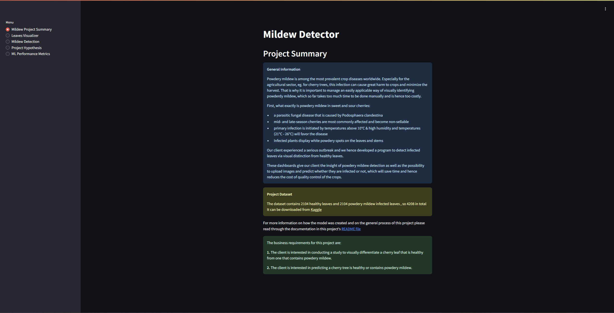
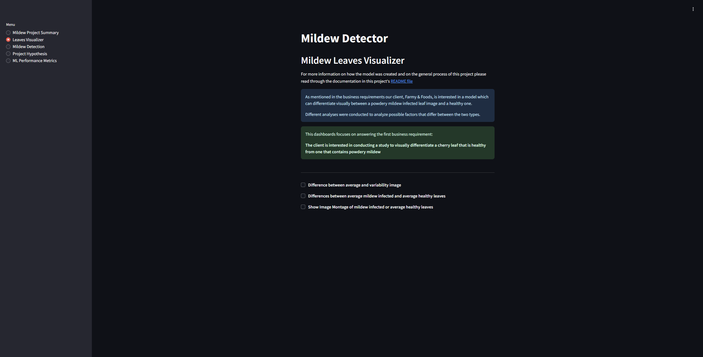
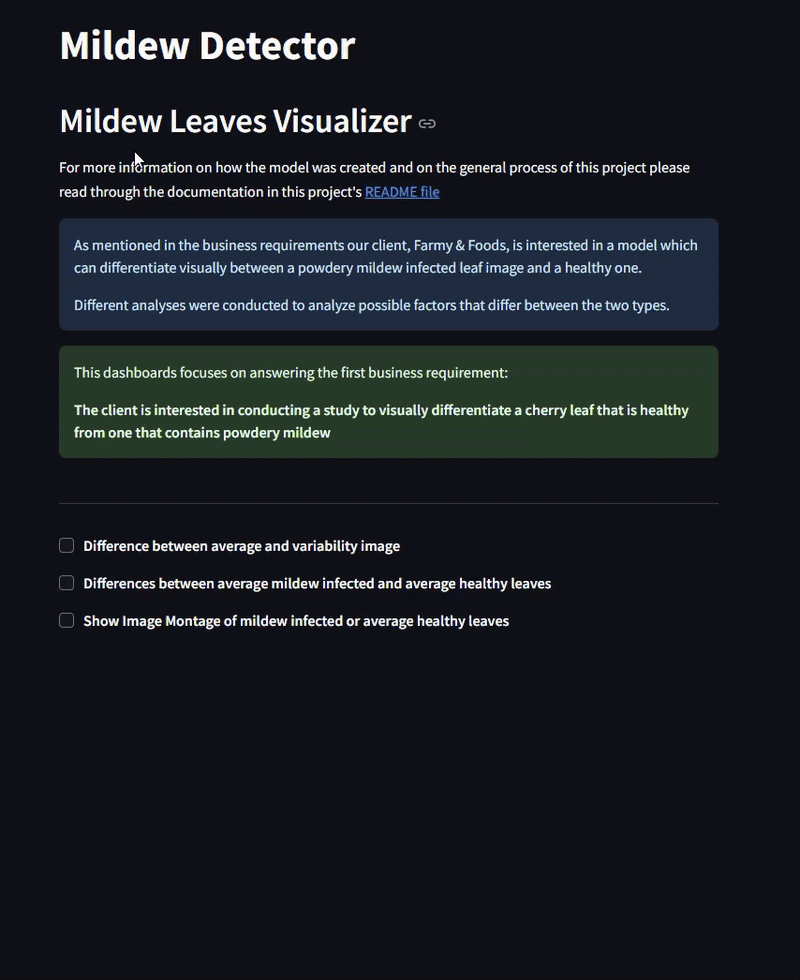
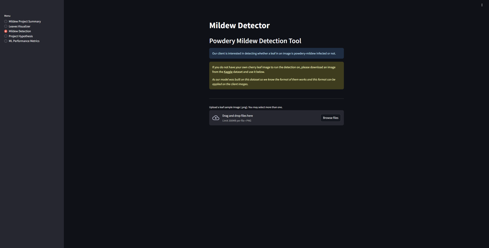
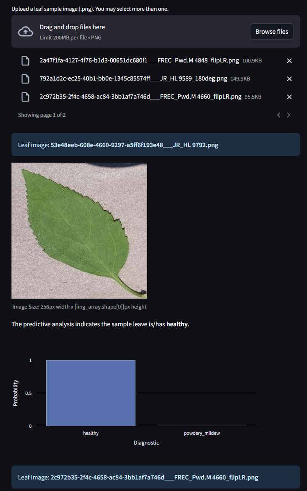
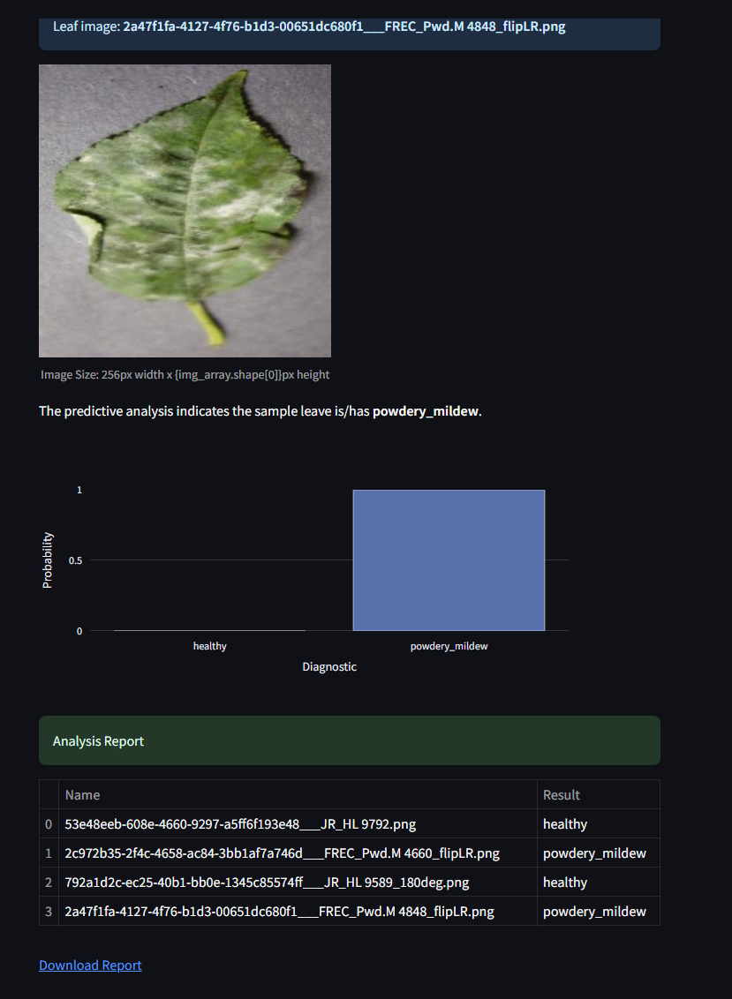
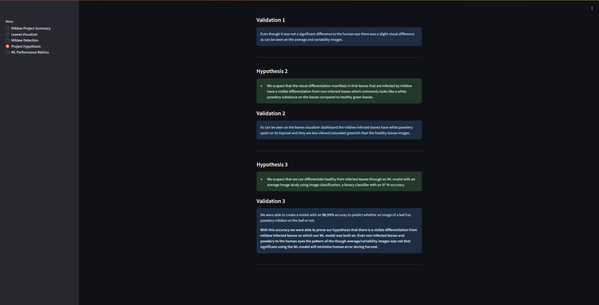
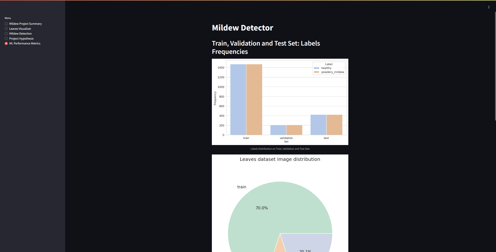
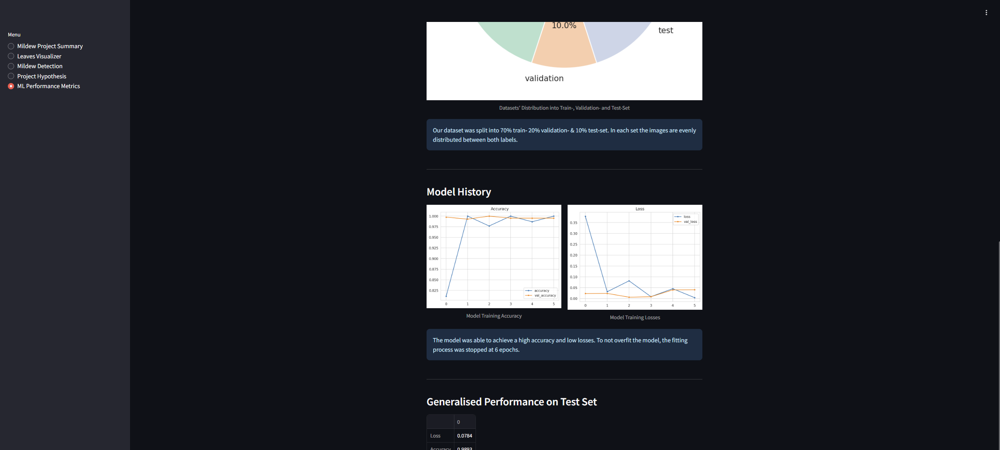
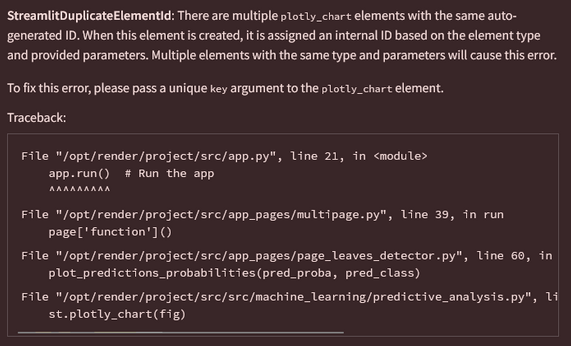

# Mildew Detection in Cherry Tree Leaves

[Mildew Detector - Deployed Website](https://pp5-mildew-detection.onrender.com/)

This "Mildew Detector" project used machine learning to predict whether cherry leaves on uploaded images are mildew-infected or not.
Powdery mildew is among the most prevalent crop diseases worldwide. Especially for the agricultural sector, eg. for cherry trees, this infection can cause great harm to crops and minimize the harvest. 
While farmers face an increasing number of hurdles during their work, especially with accelerating climate factors, there are some topics where machine learning models can take pressure from other time consuming daily tasks.
That is why it is important to manage an easily applicable way of visually identifying powdery mildew, which so far takes too much time to be done manually and is hence too costly.

Our dashboards serve our client, Farmy & Foods (a fictitious company), in giving a short overview of the models performance, as well as the ability to upload images and download a report with the prediction on which their employees can then decide which trees need treatment and which do not. Maximizing time efficiency and reducing costs.

## Contents
- [Mildew Detection in Cherry Tree Leaves](#mildew-detection-in-cherry-tree-leaves)
  - [Contents](#contents)
  - [Dataset Content](#dataset-content)
  - [Business Requirements](#business-requirements)
  - [Project Hypotheses and Validation](#project-hypotheses-and-validation)
    - [Hypothesis \& Validation 1](#hypothesis--validation-1)
    - [Hypothesis \& Validation 2](#hypothesis--validation-2)
    - [Hypothesis \& Validation 3](#hypothesis--validation-3)
  - [The rationale to map the business requirements to the Data Visualisations and ML tasks](#the-rationale-to-map-the-business-requirements-to-the-data-visualisations-and-ml-tasks)
  - [User Experience](#user-experience)
    - [Epics](#epics)
    - [User Stories](#user-stories)
  - [ML Business Case](#ml-business-case)
  - [Dashboard Design](#dashboard-design)
    - [Summary Page](#summary-page)
    - [Leaves Visualizer Page](#leaves-visualizer-page)
    - [Mildew Detection Page](#mildew-detection-page)
    - [Project Hypothesis Page](#project-hypothesis-page)
    - [ML Performance Metrics Page](#ml-performance-metrics-page)
  - [Bugs](#bugs)
    - [Fixed Bugs](#fixed-bugs)
    - [Unfixed Bugs](#unfixed-bugs)
  - [Deployment](#deployment)
    - [Preparations](#preparations)
    - [Render](#render)
    - [How to fork/clone the project locally on Github:](#how-to-forkclone-the-project-locally-on-github)
  - [Testing](#testing)
  - [Frameworks, Libraries and Programs used](#frameworks-libraries-and-programs-used)
  - [Credits \& Resources](#credits--resources)
    - [Content](#content)
    - [Other student's repositories](#other-students-repositories)
    - [Resources](#resources)
  - [Acknowledgements](#acknowledgements)

## Dataset Content

- The dataset is sourced from [Kaggle](https://www.kaggle.com/codeinstitute/cherry-leaves). We then created a fictitious user story where predictive analytics can be applied in a real project in the workplace.
- The dataset contains more than 4,000 images taken from the client's crop fields. The images show healthy cherry leaves and cherry leaves that have powdery mildew, a fungal disease that affects many plant species. The cherry plantation crop is one of the finest products in their portfolio, and the company is concerned about supplying the market with a compromised quality product.
- The dataset was provided by Code Institute, so further research if the data is credible and if we are allowed to use it was not conducted. Ideally our client could provide us in the future with updated image data, so we can train our model with even more accuracy created from and for their products.

## Business Requirements

The cherry plantation crop from Farmy & Foods is facing a challenge where their cherry plantations have been presenting powdery mildew. Currently, the process is manual verification if a given cherry tree contains powdery mildew. An employee spends around 30 minutes in each tree, taking a few samples of tree leaves and verifying visually if the leaf tree is healthy or has powdery mildew. If there is powdery mildew, the employee applies a specific compound to kill the fungus. The time spent applying this compound is 1 minute. The company has thousands of cherry trees located on multiple farms across the country. As a result, this manual process is not scalable due to the time spent in the manual process inspection.

To save time in this process, the IT team suggested an ML system that detects instantly, using a leaf tree image, if it is healthy or has powdery mildew. A similar manual process is in place for other crops for detecting pests, and if this initiative is successful, there is a realistic chance to replicate this project for all other crops. The dataset is a collection of cherry leaf images provided by Farmy & Foods, taken from their crops.

- 1 - The client is interested in conducting a study to visually differentiate a healthy cherry leaf from one with powdery mildew.
- 2 - The client is interested in predicting if a cherry leaf is healthy or contains powdery mildew.

## Project Hypotheses and Validation

### Hypothesis & Validation 1

> 1. Hypothesis: We suspect that there is a visual difference between healthy and mildew-infected leaves.

We built an average image study with images of healthy and powdery mildew infected leaves.

**Outcome**: Even though it was not a significant difference to the human eye there was a slight visual difference as can be seen on the average and variability images

.

### Hypothesis & Validation 2

> 2. Hypothesis: We suspect that the visual differentiation manifests in that leaves that are infected by mildew have a visible differentiation from non-infected leaves which commonly looks like a white powdery substance on the leaves compared to healthy green leaves.

In an image study we plot the average images next to one another to compare how they look like and we create an image montage for each label to see similiarities between singular images of the same label.

**Outcome**: As can be seen on the leaves visualizer dashboard the mildew infected leaves have white powdery spots on its topcoat and they are less vibrant/saturated greenish than the healthy leaves images.

### Hypothesis & Validation 3

> 3. Hypothesis: We suspect that we can differentiate healthy from infected leaves through an ML model with an 97 % accuracy.

We create a machine learning model with an average image study using image classification, a binary classifier, the sigmoid activation function  

**Outcome**: We were able to create a model with an 98,93% accuray to predict whether an image of a leaf has powdery mildew on the leaf or not.
With this accuracy we were able to prove our hypothesis that there is a visible differentiation from mildew infected leaves on which our ML model was built on. Even non-infected leaves and powdery to the human eyes the pattern of the though average/variability images was not that significant using the ML-model will minimize human error during harvest.

## The rationale to map the business requirements to the Data Visualisations and ML tasks

**Business requirement 1 - Data Visualization**

The client is interested in conducting a study to visually differentiate a healthy cherry leaf from one with powdery mildew.

* First we clean and prepare the data to be used in Data Visualization.
* The visualization made it possible to see and understand patterns in the data, even if they were not significant beforehand. The data quality was enhanced and ensured.
* The outputs from this step were used in the accordingly named dashboard where the user can see the average and difference within the dataset/within the labels. Hence they were visually differentiated between a healthy cherry leaf image and between an image with powdery mildew.

**Business requirement 2 - Machine Learning**

The client is interested in predicting if a cherry tree is healthy or contains powdery mildew. 

* First we focused on what functions etc. to use for our model according to our business case.
* We used our before splitted dataset (split into test- train & validation set) which were labeled into healthy and powdery_mildew images.
* We trained and optimized the model through these datasets.
* We validated our model to see if it is accurate for real time prediction.
* We created a dashboard to display our model's performance for the client to see how effective the model is.
* We created a dashboard to conduct the prediction on uploaded images and for the user to download a report about this prediction.

## User Experience

The agile methodology was applied for this project. The To-Do's were split epics and user stories and completed through sprints. To graphically represent this and not just have each sprint with its goals, tests etc on paper Github's project board was used to show this.Through our commits one can see that after each small step that worked, and through a lot of testing and fixing the code in between, one can see how this framework was well implemented into each step/sprint of the project.

>[Project Board](https://github.com/users/Xakkusu/projects/6)

### Epics

The whole process to create the service for the client from start to finish were split into three epics to meet the clients business requirement:

1. EPIC: Information gathering, data collection, data visualization, cleaning, and preparation.
   Define requirements and assess the business case with the information from the client. Gather all necessary data, install all necessary libraries and import them, clean the data, split it and prepare it to be used in the model.
2. EPIC: Model training, optimization and validation.
   Use the prepared data, augment the images to train and fit your model. Once that is done, validate it and create  images to be used in ML performance metrics.
3. EPIC: Dashboard planning, designing, development, deployment and release.
   Plan a dashboard that meets the clients needs and create an interface that is easy to use, keep in mind to answer the business requirements and validate hypotheses. Develop every page/dashboard that is needed, once this is done deploy it and make it accessible for users.

### User Stories

**User Stories from the first epic**:

- As a developer I can get access to the dataset within the IDE so that I can use it to test the hypotheses for the client.
  
  Tasks:
  - Download data from Kaggle
  - Import data to the IDE/repo
  - Test if data is usable in project environment
- As a developer I can collect data so that I can use the working cleaned data.
  
  Tasks:
  - Clean dataset
  - Split dataset into train-, test- and validation- sets
  - Prepare data for further use
- As a developer I can visualize data so that the Business Requirement 1 is fulfilled
  
  Tasks:
  - Set data directory
  - Create and save Image Shape
  - Create average and variability of images per label
  - Create a difference between average mildew-infected and average uninfected leave images
  - Create Image Montage
  - Check if anything from first epic is left undone

**User Stories from the second epic**:

- As a developer I can create, fit and train the model with data so it learns patterns to predict information from the data.
  
  Tasks:
  - Image Augmentation
  - use TensorFlow model to create classification of the data
  - use CNN
  - Save model
- As a developer I can optimize the model so that the accuracy increases.
  
  Tasks:
  - analyze over- & underfitting of the data
  - fit the data accordingly through repetition, and changing parameters if necessary
- As a developer I can test if the model is valid so that the predictions have a reliable accuracy and hence successfully answer the second business requirement.
  
  Tasks:
  - evaluate model
  - test with additional data
  - visualize applied metrics
  - Check if anything from second epic is left undonee

**User Stories from the third epic**:

- As a user I can navigate through pages and their contents easily so that I understand the outcome of the study and use the machine learning abilities with as little effort as possible.
  
  Tasks:
  - Plan easy navigation
  - Plan simple consistent design
  - Plan easily written and well structured content, that is developed one after the other
  - Plan pages to be accessible as possible

- As a client I can get a quick overview of the product so that the outcome is easily understood.
  
  Tasks:
  - Create a summary project page
  - Create content for the summary page
- As a client I can see a montage and images of the data so that my first business requirement is answered.
  
  Tasks:
  - Create a visualization page
  - Create content for the visualization page
- As a client I can upload additional data to be tested so that I can use the model for future data to predict if fungus is present or not and my second business requirement being answered through it.
  
  Tasks:
  - Create a detector page
  - Create content for the detector page
- As a client I can see all hypotheses on which the model relies on so that I can understand its validation and the model's creation better.
  
  Tasks:
  - Create a hypotheses page
  - Create content for the hypotheses page
- As a client I can look into the models metrics into detail so that I understand the model, its metrics, its performance and how it works.
  
  Tasks:
  - Create a metric page
  - Create content for the metric page
- As a developer I can access the project outside of the IDE so that it can be used to present output to the client.
  
  Tasks:
  - deploy in render.com
- As a developer I can present the final product so that the client pays for my effort and can use my project outcome.
  
  Tasks:
  - Implement User Testing
  - Final Deployment
  - Make product available to others through putting its link in README

**User Stories outside of epics**:

- Project outline: As a developer I can create a README with all its necessary content so that it can meet all the business requirements for a successful product.
  
  Tasks:
  - Create README structure
  - Come up with hypotheses that meet business requirements
  - Write README to "sell" the project to the client

## ML Business Case

- Both aboved mentioned business requirements were answered.
- The client is interested in a machine learning model to predict on  the status of leaf images: healthy and powdery-mildew infected.
- The current method for finding this out is too time and hence too cost consuming, so the client is trying to minimize their costs.
- How the model is set-up, is up to us, however the business requirements and the accuracy rate of 97% have to be met.
- The client wants an interactive dashboard to upload images whenever, wherever (as long as there is an internet connection).
- The client made a dataset available with labels: healthy and powdery-mildew infected.
- From these labels we proposed a binary classifier.
- The model predicted whether the image of a leaf is accurate with a 98.9% accuracy rate.
- The client can predict as many images at once as they have & draw a report from it, on which they can then decide on how to handel powdery-mildew infected plants.

> We conclude that our model meets the business requirements as well as all other criteria from our client.

## Dashboard Design

### Summary Page

- We provide a quick summary of the project, what business case our models works towards, give information about the dataset and go over the business requirements.
- The user should know all important points about the project and what problem the model will help solve.
- A link to the database as well as to the README of this project is provided as well.

### Leaves Visualizer Page

- This page handels the first business requirement: **The client is interested in conducting a study to visually differentiate a healthy cherry leaf from one with powdery mildew.** The client can hence further use this page for their requirement.

- By checking off the checkboxes the user can go through various images:
  - Difference between average and variability image - images are displayed side by side and on top of one another to compare them
  - Differences between average mildew infected and average healthy leaves - images are displayed side by side to compare them
  - Image Montage -choose label from dropdown menu and the montage will appear
- The machine learning model is built on these findings.

### Mildew Detection Page

- This page handels the second business requirement: **The client is interested in predicting if a cherry leaf is healthy or contains powdery mildew.** The client can hence further use this page for future images to run detection on.
- The user can upload PNG images to detect whether powdery mildew is present or not.
- A link to the dataset it provided in case the user does not have their own image to draw a report from.

- The user can upload as many PNG-images as they like.
- For every singular image there is a message about the powdery-mildew status and a diagram.
- At the bottom of the page the user can download their report.

### Project Hypothesis Page

- This page provides an explanation of our assumptions before starting our project, as shown in our three hypotheses.
- After finishing our Model we drew our conclusions in the validation sections on how and why they were validated.
- You can read more on our hypothesis [here](#project-hypotheses-and-validation).

### ML Performance Metrics Page

- This page provides more insights into our model and the data that was used.
- We display the label frequencies and how our datasets are divided.
- We display our accuracy and models over epochs shown in the diagrams.
- We display our accuracy which is vital for answering the second business requirement as well as our third hypothesis.

## Bugs

### Fixed Bugs

1. While working in my jupyter notebook the Codespace IDE kept on crashing multiple times, maybe because of the data size, yet there was never an error message which explained why. I had to redo/restart multiple codespaces completely anew which meant I had to install and go through all the previous steps continuously and ran everything from the beginning due to it. After it did not crash after some time, everything had to be pushed again.
2. When I created the new codespace while pushing the outputs from jupyter notebook two (Data Visualization) only a few files (4) were pushed instead of all that were in my outputs folder in my IDE. After trying to redo the whole output folder content multiple times and pushing files by themself I rerun all notebooks again and pushed after every new output file was created to check which was causing problems, none did... So I do not know how that bug happened or how it would have been solved. There were also no problems with v2 output files, so I guess the IDE had some troubles at the time.
3. While working on the third Jupyter Notebook and trying to fit my model the Kernel kept crashing. I rerun all notebooks but once it crashed during fitting it started crashing on most code blocks. I cleared caches, tried to look for bugs in my libraries, checked my memory and made space for my datasets. Once that was cleared,  rerun all notebooks without errors and pushed it. 
4. With my first I had a problem with the prediction. It always predicted the wrong label but in a correct way. So it always said *healthy* for infected ones and vice versa. As I did not know the ``softmax`` activation function that well and I used it in my first version, I wanted to see if that would be the problem and switched to the ``sigmoid`` activation function as done in the walkthrough and it was thus easier to understand for me, then the model predicted correctly.
5. When running detection on more than two images I got the following error message: 

  
    As stated in the error message I implemented keys for a large number, so a large number of images could be predicted at once. The following code was used for this:

    ``keys = [x for x in range(100000)]``

    ``st.plotly_chart(fig, key=random.sample(keys, 1))``
6. Not really a bugfix, but when I did the malaria project I already was not able to deploy it on Heroku, so my mentor recommended [render.com](https://render.com/) so I saved a lot of bugfixes through using this.

### Unfixed Bugs

So far there are no known bugs.

## Deployment

### Preparations

- Store all dependencies in ``requirements.txt`` file.

### Render

> OPTIONAL

- Delete Procfile
- Delete runtime.txt
- Add, commit, and push your changes to GitHub

> MANDATORY

1. Log in to Render (your github account needs to be connected to your render account) and click on new.
2. Select Web Service
3. Search the name of the desired repository and connect it.
4. Check for the settings to match:
   - Set the Name
   - Leave root directory blank
   - Define Python 3 as the environment
   - Set the region to your region
   - Set Branch to main
5. Set the build command ``pip install -r requirements.txt && ./setup.sh``.
6. Set the start command ``streamlit run app.py``.
7. Set the plan (I used the standard plan because of the size of my project and due the free version not being able to process the code properly).
8. Set the environment variables:
     - ``PORT``  ``8501``
     - ``PYTHON_VERSION``  ``3.12.1``
9.  Select the advanced setting.
10. Set Auto-Deploy to your preference.
11. Select **Create Web Service**.
12. Deploy

The live link can be found here - [Mildew Detector - Deployed website](https://pp5-mildew-detection.onrender.com/)

### How to fork/clone the project locally on Github:

> Need to install dependencies from requirements.txt

Fork the repository:

- Log in (or sign up) to Github.
- Go to the repository for: Xakkusu/PP5-mildew-detection.
- Click the Fork button in the top right corner.

Clone repository:

1. Log in (or sign up) to GitHub.
2. Go to the repository for: Xakkusu/PP5-mildew-detection.
3. Click on the code button, select whether you would like to clone with HTTPS, SSH or GitHub CLI and copy the link shown.
4. Open the terminal in your code editor and change the current working directory to the location you want to use for the cloned directory.
5. Type 'git clone' into the terminal and then paste the link you copied in step 3. Press enter.
6. A clone of the repository will now be created on your machine.

## Testing

## Frameworks, Libraries and Programs used

- [Am I Responsive](https://ui.dev/amiresponsive) Used for the mockup image.
- [GitHub](https://GitHub.com/) - Used for version control.
- [Github's Codespacs](https://github.com/features/codespaces) - IDE to develop the website.
- [Google Chrome Dev Tools](https://developers.google.com/web/tools/chrome-devtools)- Used for troubleshooting, debugging, inspecting page's elements & testing responsiveness.
- [Render](https://render.com/) - Used to deploy the project.
- [Code Institute's milestone-project-mildew-detection-in-cherry-leaves repository](https://github.com/Code-Institute-Solutions/milestone-project-mildew-detection-in-cherry-leaves) - Forked for base structure of files and README.
- [Kaggle](https://www.kaggle.com/codeinstitute/cherry-leaves) - Used as the source for the dataset.
- [Jupyter Notebook]() - Used for the notebook's coding environment.
- [Joblib](https://joblib.readthedocs.io/en/stable/) - Used to load and use images.
- [NumPy](https://numpy.org/) - Used for arrays.
- [Pandas](https://pandas.pydata.org/) - Used to create dataframes.
- [Matplotlib](https://matplotlib.org/) - Used to plot distribution and visualizing data.
- [Seaborn](https://seaborn.pydata.org/) - Used for graphs, figures and visualizing data.
- [Plotly](https://plotly.com/) - Used to plot learning curve and visualizing data
- [Streamlit](https://streamlit.io/) - Used to create dashboards.
- [Scikit-Learn](https://scikit-learn.org/stable/) - Used for model evaluation.
- [Tensorflow](https://www.tensorflow.org/) - Used for creating and fitting the model.
- [Pillow](https://python-pillow.github.io/) - Used for image manipulation.
- [Keras](Keras) - Used for creating and fitting the model.
- [Python](https://www.python.org/) - Used as one of the coding languages.

## Credits & Resources

### Content

- The text in for the summary dashboard was compiled from [this article from EOS Data Analytics](https://eos.com/blog/powdery-mildew/) about Powdery Mildew,  [Wikipedia's Powdery mildew](https://en.wikipedia.org/wiki/Powdery_mildew) article & from [this publication from Washington State University](https://treefruit.wsu.edu/crop-protection/disease-management/cherry-powdery-mildew/)  about Cherry Powdery Mildew.

### Other student's repositories

- [Cla-cif's cherry powdery mildew detector repository](https://github.com/cla-cif/Cherry-Powdery-Mildew-Detector) as recommended by my mentor for structure and what is needed in this project. When I got stuck their code was used to see where I made mistakes.
- [HughKeenan's Detection of mildew on cherry leaves repository](https://github.com/HughKeenan/CherryPicker) as recommended by my mentor for structure and what is needed in this project. When I got stuck their code was used to see where I made mistakes.

### Resources

- Tutorials from Code Institute's lessons that we learned in the course of our diploma-education used to understand the basic concepts of Python. Especially topics from the Malaria Detector project were helpful.
- [Stack Overflow](https://stackoverflow.co/)
- [W3Schools](https://www.w3schools.com/)

## Acknowledgements

- My mentor Mo Shami for their guidance and support.
- Code Institute for course material.
- The Code Institute's Slack community for support.
- All students with whom I was able to exchange ideas for our projects.
- My cats
